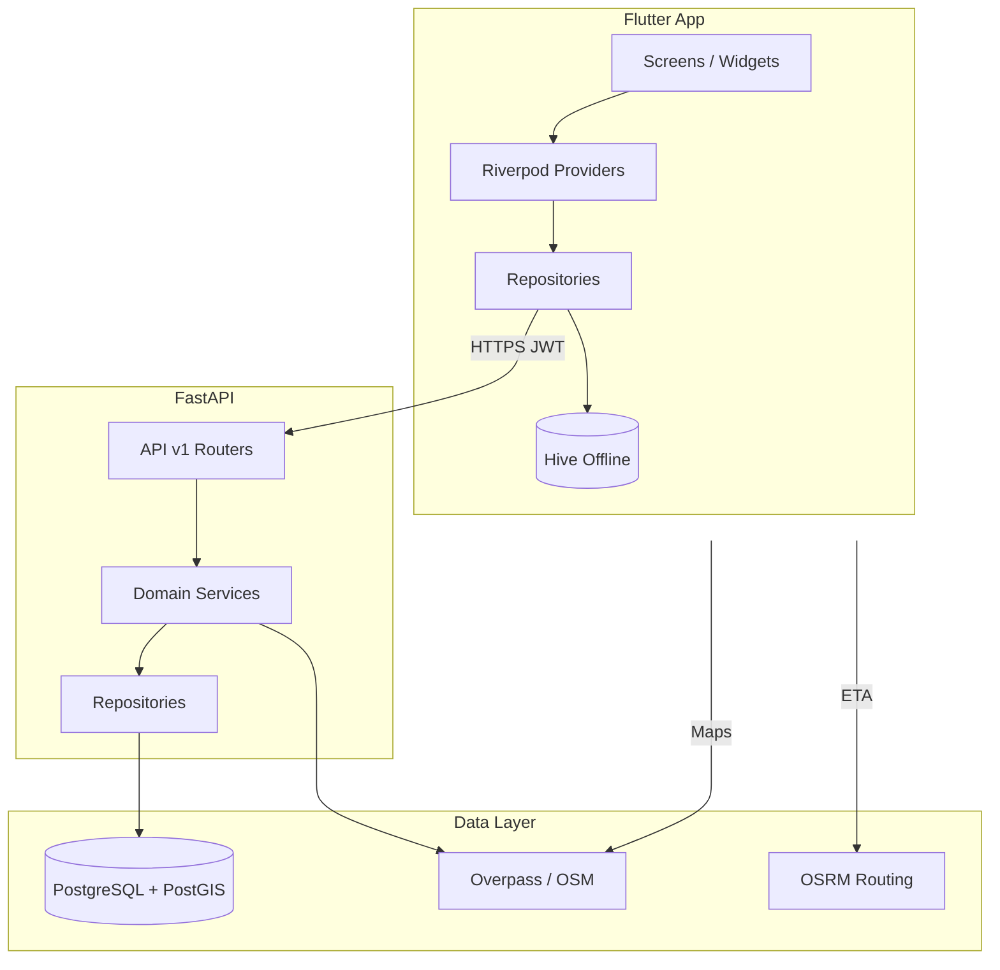

# RoadSoS – System Architecture

## High-Level Overview

## Clean Architecture (Flutter)

| Layer | Responsibility |
|-------|----------------|
| **Presentation** | Screens, widgets, Riverpod notifiers |
| **Domain** | Entities, repository interfaces, use cases |
| **Data** | API client, DTOs, Hive adapters, repository impl |

## Backend Layers

| Layer | Path | Role |
|-------|------|------|
| API | `app/api/v1/` | HTTP, validation, auth deps |
| Services | `app/services/` | Business logic (SOS, nearby) |
| Repositories | `app/repositories/` | SQLAlchemy queries |
| Models | `app/models/` | ORM entities |
| Schemas | `app/schemas/` | Pydantic DTOs |

## Core Flows

### SOS Trigger

1. User presses SOS → `Geolocator` gets lat/lng
2. `SosRepository.triggerSos()` → `POST /api/v1/sos/trigger`
3. Backend: create `Incident`, fetch nearby services, return payload
4. App: show nearest list, open SMS/share to emergency contacts
5. Hive: cache incident + services for offline review

### Nearby Services

1. `GET /api/v1/services/nearby?latitude=&longitude=&category=`
2. PostGIS `ST_Distance` + `ST_DWithin` on `services.geom`
3. Optional OSM Overpass fallback in service layer
4. Client sorts by distance; OSRM for ETA when online

### Offline Mode

- **Always local**: 112/108/101, first-aid cards, SOS message template
- **Cached**: last nearby services query, emergency contacts, user profile
- **Degraded SOS**: share location via SMS/maps link without API

## Security

- JWT access tokens (15 min) + refresh (7 days)
- User-scoped contacts and incidents
- No PII in logs; coordinates only in incident records

## Deployment (Hackathon Demo)

- `docker compose`: PostGIS + API
- Flutter: Android emulator / device with `10.0.2.2:8000` for API
- Production: Railway/Render API + Supabase/Neon Postgres
