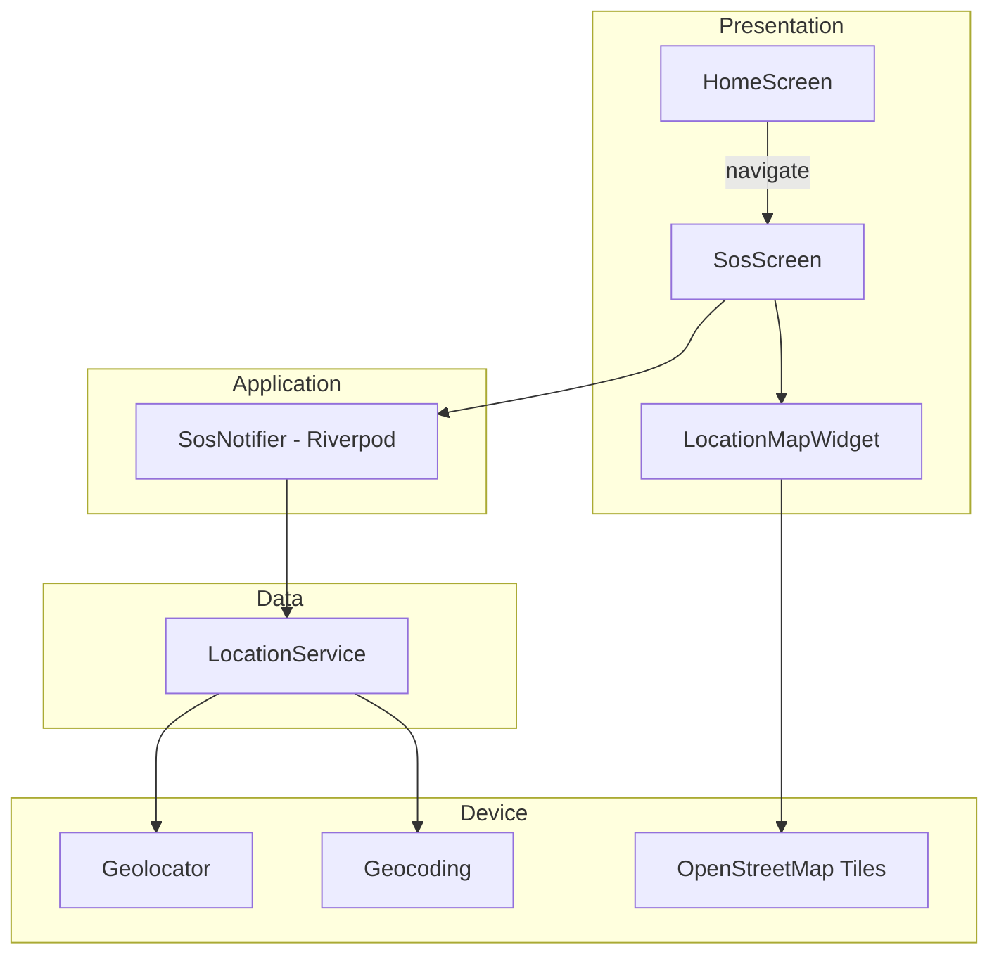
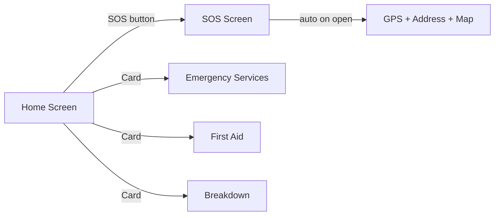

# RoadSoS Phase 1 – Architecture

## 1. Architecture overview



**Clean Architecture layers (per feature)**

| Layer | Responsibility |
|-------|----------------|
| **Presentation** | Widgets, navigation, loading/error UI |
| **Application** | `SosNotifier` – orchestrates location fetch state |
| **Domain** | `LocationInfo` entity |
| **Data** | `LocationService` – Geolocator + Geocoding |

## 2. Folder structure

```
lib/
├── main.dart
├── core/
│   ├── theme/app_theme.dart
│   └── errors/location_failure.dart
├── features/
│   ├── home/
│   │   └── presentation/
│   │       ├── home_screen.dart
│   │       └── widgets/
│   │           ├── sos_button.dart
│   │           └── quick_action_card.dart
│   ├── sos/
│   │   ├── domain/location_info.dart
│   │   ├── data/location_service.dart
│   │   ├── application/sos_provider.dart
│   │   └── presentation/
│   │       ├── sos_screen.dart
│   │       └── widgets/location_map_widget.dart
│   └── services/
│       └── presentation/
│           ├── emergency_services_screen.dart
│           ├── first_aid_screen.dart
│           └── breakdown_screen.dart
└── shared/
    └── widgets/error_message.dart
```

## 3. Required dependencies

```yaml
flutter_riverpod: ^2.6.1   # State management
geolocator: ^13.0.2        # GPS + permissions
geocoding: ^3.0.0          # Reverse geocoding
flutter_map: ^7.0.2        # OSM map
latlong2: ^0.9.1           # Coordinates for flutter_map
```

## 4. Screen flow



**SOS screen states**

1. `loading` – fetching location  
2. `success` – show lat, lng, address, centered map with marker  
3. `error` – GPS off / permission denied / timeout – message + Retry  
